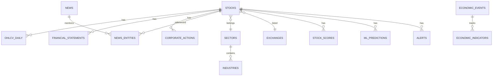

# Data Model

PostgreSQL is the system of record. DuckDB is the analytical engine over
Parquet history. This document defines the schema, timestamp conventions,
index strategy, and the split of responsibilities.

## 1. Naming and conventions

- Lowercase `snake_case` table and column names. Tables plural.
- Primary keys: surrogate `id BIGSERIAL` unless a natural key is strictly
  unique and stable (e.g. ticker in `stocks`).
- Every row that represents a fact or observation carries the timestamp
  triplet where applicable (PRD §3):

  | Column | Meaning |
  |---|---|
  | `timestamp` | when the row/calculation was written |
  | `effective_timestamp` | when the value became true in the world (trade date / event date) |
  | `source_timestamp` | when the provider reported it |

- Fundamental rows additionally carry:

  | Column | Meaning |
  |---|---|
  | `reported_at` | as-reported date |
  | `period_start` / `period_end` | fiscal period bounds |
  | `available_at` | earliest time the data was actually usable (point-in-time availability) |

  **`available_at` is the single most important column for unbiased
  backtesting.** Consumers must filter by `available_at <= asof`, never by
  `reported_at` or `period_end`.

- Currency: `IDR` for all price/cap data. Money as `NUMERIC(18,2)`, ratios as
  `DOUBLE PRECISION`, prices as `NUMERIC(18,4)` or `DOUBLE PRECISION` when
  Parquet/Polars does the math.

### Audit timestamps — every row, every table

**Every table carries `created_at` and `updated_at`.** This is mandatory for
all entities in §3-§13, including tables where the column list below omits
them for brevity.

| Column | Type | Default | Meaning |
|---|---|---|---|
| `created_at` | `timestamptz NOT NULL` | `now()` | when the row was inserted (row creation time) |
| `updated_at` | `timestamptz NOT NULL` | `now()` | when the row was last modified |

Rules:

- `created_at` is set once by the DB on insert (`DEFAULT now()`). Never set in
  application code; never modified afterward.
- `updated_at` is bumped automatically on every `UPDATE` (one trigger per
  table, or ORM `onupdate`; the DB-trigger form is preferred so bulk loads
  also update it).
- Rows that are facts in the world (OHLCV, scores, predictions, events) are
  **append-only**: `created_at` records when the fact was written; the
  business-time columns (`effective_timestamp` / `available_at` / `asof`)
  record when it became true. Never conflate the two.
- History/event tables (`alert_events`, `ml_predictions`, `backtest_trades`,
  `universe_history`, `job_runs`, `ingestion_runs`) are write-once:
  `updated_at` may stay equal to `created_at`; treat writes as inserts only.
- Audit guarantee: for any row, `created_at` identifies when the system
  recorded it. Combined with `available_at` (world truth) this supports the
  reproducibility contract in `docs/architecture.md` §7.

Full mapping of every entity → its timestamp columns is in §14
("Timestamp matrix").

## 2. Entity relationship overview

## 3. Reference tables

### `stocks`
Universe membership. Seeded from `stock-list.xlsx`.

| Column | Type | Notes |
|---|---|---|
| `id` | bigserial PK | |
| `ticker` | text unique not null | e.g. `BBCA` |
| `name` | text | Indonesian legal name |
| `listing_date` | date | "Tanggal Pencatatan" |
| `board` | text | Utama / Pengembangan / Pemantauan Khusus / Akselerasi / Papan Baru |
| `shares_outstanding` | numeric | from stock-list.xlsx ("Saham"); refreshed from provider |
| `sector_id` | fk → sectors | may be null until classified |
| `industry_id` | fk → industries | |
| `exchange_id` | fk → exchanges | default IDX |
| `status` | text | active / suspended / delisted / newly_listed |
| `is_active` | boolean | current tradability |
| `listed_at`, `delisted_at` | timestamptz | history for survivorship-safe backtests |
| `created_at`, `updated_at` | timestamptz | |

`ponytail:` Historical sector membership is tracked via a join table when
sector-rotation backtests require it; add `stock_sector_history`.

### `sectors`, `industries`, `exchanges`, `indices`
Stable reference tables with `id`, `code`, `name`, `created_at`.

- `sectors`: IDX sector classifications (e.g. `FINANCIALS`, `ENERGY`).
- `indices`: IHSG (`^JCI`/`IHSG`), sector indices, LQ45, IDX30, IDX80, plus
  foreign benchmarks (SPX, IXIC, DJI) for macro correlation.

### `universe_history`
Survivorship-safe membership (PRD §64).

| Column | Type |
|---|---|
| `id` | bigserial PK |
| `ticker` | text |
| `effective_from` | timestamptz |
| `effective_to` | timestamptz null |
| `status` | text |

Backtests resolve the universe at each date from this table, not from current
`stocks.is_active`.

## 4. Market data

### `ohlcv_daily`

| Column | Type | Notes |
|---|---|---|
| `id` | bigserial PK | |
| `ticker` | text not null | |
| `trade_date` | date not null | `effective_timestamp` |
| `open`, `high`, `low`, `close` | numeric | raw, unadjusted |
| `volume` | numeric | shares traded |
| `turnover` | numeric | IDR value |
| `adjustment_factor` | numeric | cumulative factor from corporate actions |
| `adj_close` | numeric | close × adjustment_factor |
| `split_factor` | numeric | per-row action factor, default 1 |
| `provider` | text | source vendor |
| `source_timestamp` | timestamptz | |
| `created_at` | timestamptz | |

Unique: `(ticker, trade_date, provider)`. Composite index
`(ticker, trade_date)`.

**Adjusted prices:** store raw OHLC plus a cumulative `adjustment_factor`.
Derived adjusted OHLC computed at query time as `raw * adjustment_factor`.
Never mutate raw prices. Corporate actions update the factor going **backward**
(so adjusted series is continuous) while raw prices reflect the actual traded
history.

### `ohlcv_intraday`
Same shape + `interval` column (`1m`, `5m`, `15m`, `60m`). Unique
`(ticker, trade_date, interval, ts)`. Populated only when a provider offers
intraday (PRD: "where available").

### `quotes`
Latest snapshot per ticker: last price, change, volume, turnover, market cap,
bid/ask where available. Unique `ticker`. Refreshed by ingestion job.

### `index_data`
Daily index OHLCV for `indices`. Unique `(index_id, trade_date)`.

## 5. Fundamentals

### `financial_statements`
Raw statement line items, one row per (statement, period, variant).

| Column | Type | Notes |
|---|---|---|
| `id` | bigserial PK | |
| `ticker` | text | |
| `statement_type` | text | income / balance / cashflow |
| `period_start`, `period_end` | date | |
| `reported_at` | date | |
| `available_at` | timestamptz | **point-in-time gate** |
| `is_annual` | boolean | annual vs quarterly/cumulative |
| `is_restated` | boolean | restatement flag; keep both versions |
| `items` | jsonb | key → value (revenue, net_income, eps, ...) |
| `currency` | text | IDR |
| `created_at` | timestamptz | |

Use `jsonb` for flexible line items; pivot into columns only for
high-frequency query columns. Restatements stored as new rows, never updated.

### `financial_ratios`
Computed ratios at point-in-time.

| Column | Type |
|---|---|
| `id` | bigserial PK |
| `ticker` | text |
| `asof_date` | date | trade date the ratio is valid for |
| `available_at` | timestamptz |
| `period_end` | date |
| `ratios` | jsonb | per, pbv, psr, ev_ebitda, roe, roa, roic, npm, gpm, opm, debt_equity, current_ratio, interest_coverage, fcf_yield, dividend_yield, ... (PRD §4) |

Unique `(ticker, asof_date, period_end)`.

### `dividends`
`ticker`, `announce_date`, `ex_date`, `record_date`, `pay_date`, `amount_per_share`, `currency`, `available_at`. Drives dividend yield + adjustment factors.

## 6. Corporate actions

### `corporate_actions`
| Column | Type |
|---|---|
| `id` | bigserial PK |
| `ticker` | text |
| `action_type` | text | dividend / split / reverse_split / rights / bonus / buyback |
| `announce_date` | date |
| `ex_date` | date |
| `record_date` | date |
| `ratio` | jsonb | e.g. `{"split": 2}` or `{"bonus": 0.5}` |
| `details` | jsonb |
| `available_at` | timestamptz |

Consumed by ingestion to (a) build adjustment factors and (b) flag
price/volume anomalies around ex-dates.

## 7. Macro

### `economic_indicators`
Time series: BI rate, inflation, GDP, CPI, PMI, unemployment, trade balance,
current account, USD/IDR, bond yields, US Treasury yields, commodities (oil,
gold, coal, CPO, nickel, copper), DXY, global indices.

| Column | Type |
|---|---|
| `id` | bigserial PK |
| `indicator` | text | canonical code, e.g. `bi_rate`, `usd_idr`, `cpo` |
| `country` | text |
| `asof_date` | date |
| `value` | numeric |
| `source` | text |
| `source_timestamp` | timestamptz |
| `available_at` | timestamptz |

Unique `(indicator, asof_date, source)`.

### `economic_events`
Calendar entries (PRD §4).

| Column | Type |
|---|---|
| `id` | bigserial PK |
| `event_name` | text |
| `country` | text |
| `scheduled_time` | timestamptz |
| `importance` | integer | 1-3 (low/high) |
| `previous`, `consensus`, `actual` | numeric |
| `unit` | text |
| `surprise` | numeric | actual − consensus, normalized |
| `status` | text | scheduled / released / cancelled |
| `source` | text |

### `economic_impact`
Historical market/sector/stock reaction per event type (PRD §16): event type,
`impact_horizon` (1D/5D), IHSG avg return, volatility, `sample_size`,
`historical_probability`, `confidence`. Stored, never presented as prediction.

## 8. News

### `news`
| Column | Type |
|---|---|
| `id` | bigserial PK |
| `title` | text |
| `source` | text |
| `url` | text |
| `published_at` | timestamptz |
| `content` | text |
| `event_type` | text |
| `sentiment` | numeric | −1..1; null until computed |
| `importance` | integer |
| `confidence` | numeric |
| `enrichment` | text | `RAW` or `AI_ENRICHED` (PRD §17) |
| `provider` | text |

### `news_entities`
Join: `news_id` ↔ `entity_type` (`stock`/`sector`/`indicator`) ↔ `entity_id`
(ticker/sector code/indicator code), with `relevance` score.

### `news_sentiment_scores`
Per ticker per day: `sentiment`, `source_quality`, `relevance`, `recency`,
`confidence`, aggregate `news_sentiment_score`. Unique `(ticker, asof_date)`.

## 9. Features and scores

### `technical_features`
One row per ticker per trade date (or per scan date for latest-only):
`rsi_14`, `macd`, `macd_signal`, `sma_20/50/200`, `atr_14`, `adx`,
`supertrend`, `ichimoku`, `volatility_20`, `volume_sma`, `relative_volume`,
`obv`, `mfi`, `cmf`, price-structure flags, `feature_version`. Key
`(ticker, asof_date, feature_version)`.

### `fundamental_features`, `factor_features`, `macro_features`
Same pattern: computed values + `asof_date` + `feature_version`. Macro
features are per-date (shared across stocks).

### `stock_scores`
| Column | Type |
|---|---|
| `id` | bigserial PK |
| `ticker` | text |
| `asof_date` | date |
| `profile` | text | scoring profile name |
| `scoring_version` | text |
| `opportunity_score` | numeric |
| `technical_score`, `fundamental_score`, `momentum_score`, `relative_strength`, `smart_money_score`, `factor_score`, `sector_score`, `macro_score`, `risk_score`, `ml_score` | numeric | 0-100 each |
| `score_components` | jsonb | full breakdown for explainability (PRD §36) |
| `classification` | text | opportunity / watchlist / neutral / high_risk / avoid |
| `confidence` | numeric |
| `drivers`, `risks`, `invalidation_conditions` | jsonb |
| `created_at` | timestamptz |

Unique `(ticker, asof_date, profile, scoring_version)`.

### `scoring_profiles`
Configurable weight sets (PRD §19, §47). `name`, `weights` jsonb, `version`,
`is_default`, `created_at`. Seed: aggressive, balanced, conservative, value,
momentum, swing, long_term.

### `market_regimes`
`asof_date`, `regime` (STRONG_BULLISH..RISK_OFF), `regime_score` jsonb
(component contributions), `model_version`, unique `(asof_date)`.

### `market_breadth`
`asof_date`, `advance`, `decline`, `new_highs`, `new_lows`, `pct_above_sma20/50/200`,
`breadth_score`, `volume_breadth`, `breakout_breadth`, `momentum_breadth`.

### `sector_scores`
`asof_date`, `sector_id`, performance, relative strength, momentum, volume,
breadth, valuation, `rotation_class` (leading/improving/weakening/lagging),
`sector_score`.

## 10. ML

### `ml_models`
Registry: `model_name`, `model_version`, `target`, `horizon`, `features_hash`,
`feature_version`, `training_start`, `training_end`, `metrics` jsonb
(accuracy, roc_auc, IC, Sharpe...), `artifact_path`, `status`,
`created_at`. Unique `(model_name, model_version)`.

### `ml_predictions`
**Append-only. Never overwrite or delete.**

| Column | Type |
|---|---|
| `id` | bigserial PK |
| `ticker` | text |
| `asof_date` | date |
| `model_name`, `model_version` | text |
| `feature_version` | text |
| `prediction_timestamp` | timestamptz |
| `probability` | numeric |
| `expected_return` | numeric |
| `confidence` | numeric |
| `prediction_class` | text | e.g. up/down or return bucket |

Index `(ticker, asof_date)`, `(model_name, model_version)`.

## 11. Portfolio, risk, backtest, alerts

### `portfolios`, `portfolio_positions`
`portfolios`: user-owned, name, config. `positions`: `portfolio_id`, `ticker`,
`weight` or `quantity`, `target_weight`. Analysis results cached in
`portfolio_analyses` (jsonb metrics + `asof_date`).

### `backtests`
`strategy` jsonb (rules/params), `universe` jsonb, `start`/`end`,
`feature_version`, `scoring_version`, `metrics` jsonb (CAGR, Sharpe, Sortino,
MaxDD, Calmar, win rate, profit factor, expectancy, holding period, turnover),
`model_version` nullable, `created_at`. Unique-ish per identical config.

### `backtest_trades`
`backtest_id`, `ticker`, `entry_date`, `exit_date`, `entry_price`, `exit_price`,
`shares`, `pnl`, `fees`, `slippage`, `exit_reason` (stop/tp/trailing/signal/end).

### `alerts`
`ticker` nullable, `rule_type`, `params` jsonb, `enabled`, `user_id`,
`last_triggered_at`, `created_at`.

### `alert_events`
Append-only log: `alert_id`, `triggered_at`, `value`, `triggered_by` (job/scan),
`payload` jsonb.

### `users`, `api_keys`
`users`: id, email, role (admin/user), hashed_password. `api_keys`: user_id,
key_hash, scopes, expires_at.

### User terminal state (DESIGN §56-59)
Persisted per user so the terminal restores research context.

### `watchlists`
`user_id`, `name` (default "Watchlist"), `entries` jsonb (ordered ticker
list), `is_pinned` (pinned stocks overlay), `created_at`, `updated_at`.
Unique `(user_id, name)`.

### `workspaces` (saved layouts)
`user_id`, `name`, `layout` jsonb: panels (type, position, size), selected
ticker, chart indicators, filters, table columns, timeframe, watchlist ref,
panel sizes. Unique `(user_id, name)`.

### `saved_screeners`
`user_id`, `name`, `filters` jsonb (rule tree compatible with screener
engine), `columns` jsonb (result table config), `is_shared`,
`created_at`. Seed example `high_quality_momentum` (see `docs/scoring.md` §9).

### `saved_research_queries`
`user_id`, `prompt`, `filter_tree` jsonb (LLM-translated or manual filters),
`result_metadata` jsonb, `created_at`. Keeps research reproducible and
shareable (DESIGN §32, §51).

## 12. Data quality

### `data_quality_reports`
`ticker`, `asof_date`, `quality_score` (0-100), `issues` jsonb
(missing days, duplicates, abnormal prices, negative volume, stale data,
timestamp inconsistencies), `source`, `created_at`. Unique
`(ticker, asof_date, source)`.

## 13. Job & observability tables

### `ingestion_runs`, `job_runs`
`job_name`, `status` (running/success/failed/partial), `started_at`,
`finished_at`, `rows_processed`, `errors` jsonb, `details` jsonb.

### `ingestion_checkpoints`
Watermark for incremental crawling (`docs/data-pipeline.md` §2.1). One row
per `(job_name, provider)`.

| Column | Type |
|---|---|
| `id` | bigserial PK |
| `job_name` | text |
| `provider` | text |
| `watermark` | timestamptz | last successfully fetched boundary |
| `last_run_at` | timestamptz |
| `last_success_at` | timestamptz |
| `last_error` | text |
| `created_at`, `updated_at` | timestamptz |

Unique `(job_name, provider)`. The watermark is advanced **only after** a
validated successful fetch — a failed run leaves it untouched so the next run
refetches from the last good boundary.

### `data_freshness`
Per table/provider: `last_updated_at`, `max_trade_date`, `row_count`,
`expected_cadence`.

### `system_settings` / `feature_flags`
Key-value for `LLM_ENABLED`, `ML_ENABLED`, `LLM_*_ENABLED`, `ML_*_ENABLED`,
`AI_ENABLED`, and tunable thresholds. Read from Postgres so operators can flip
without redeploy; env vars provide defaults and secrets.

## 14. Timestamp matrix

Every entity below has `created_at` + `updated_at` (see §1 audit timestamps).
The "Business time" column lists the meaningful time columns the domain
operates on — `created_at` records *when the system wrote the row*, business
time records *when the fact became true*.

| Entity | created_at / updated_at | Business time |
|---|---|---|
| `stocks` | ✓ / ✓ | `listing_date`, `delisted_at` |
| `sectors`, `industries`, `exchanges`, `indices` | ✓ / ✓ | — |
| `universe_history` | ✓ (write-once) | `effective_from`, `effective_to` |
| `ohlcv_daily` | ✓ / ✓ | `trade_date` (effective), `source_timestamp` |
| `ohlcv_intraday` | ✓ / ✓ | `trade_date`, interval `ts` |
| `quotes` | ✓ / ✓ | snapshot `asof` |
| `index_data` | ✓ / ✓ | `trade_date` |
| `financial_statements` | ✓ (append-only) | `reported_at`, `period_start`, `period_end`, `available_at` |
| `financial_ratios` | ✓ / ✓ | `asof_date`, `available_at`, `period_end` |
| `dividends` | ✓ / ✓ | `announce_date`, `ex_date`, `record_date`, `pay_date`, `available_at` |
| `corporate_actions` | ✓ / ✓ | `announce_date`, `ex_date`, `record_date`, `available_at` |
| `economic_indicators` | ✓ / ✓ | `asof_date`, `source_timestamp`, `available_at` |
| `economic_events` | ✓ / ✓ | `scheduled_time`, `source_timestamp` |
| `economic_impact` | ✓ (write-once) | event period bounds |
| `news`, `news_entities` | ✓ / ✓ | `published_at` |
| `news_sentiment_scores` | ✓ / ✓ | `asof_date` |
| `technical_features`, `fundamental_features`, `factor_features`, `macro_features` | ✓ / ✓ | `asof_date`, `feature_version` |
| `stock_scores` | ✓ / ✓ | `asof_date`, `scoring_version` |
| `scoring_profiles` | ✓ / ✓ | `version` |
| `market_regimes` | ✓ / ✓ | `asof_date` |
| `market_breadth` | ✓ / ✓ | `asof_date` |
| `sector_scores` | ✓ / ✓ | `asof_date` |
| `ml_models` | ✓ / ✓ | training window, `feature_version` |
| `ml_predictions` | ✓ (append-only) | `asof_date`, `prediction_timestamp`, `model_version` |
| `portfolios`, `portfolio_positions` | ✓ / ✓ | — |
| `backtests` | ✓ / ✓ | `start`, `end` |
| `backtest_trades` | ✓ (write-once) | `entry_date`, `exit_date` |
| `alerts` | ✓ / ✓ | `last_triggered_at` |
| `alert_events` | ✓ (write-once) | `triggered_at` |
| `users`, `api_keys` | ✓ / ✓ | — |
| `watchlists`, `workspaces`, `saved_screeners`, `saved_research_queries` | ✓ / ✓ | — |
| `data_quality_reports` | ✓ (write-once) | `asof_date` |
| `ingestion_runs`, `job_runs` | ✓ / ✓ | `started_at`, `finished_at` |
| `data_freshness` | ✓ / ✓ | `last_updated_at`, `max_trade_date` |

Write-once means inserts only; `updated_at` stays equal to `created_at`.

## 15. Low-latency read path

PostgreSQL is the primary store (PRD §5). Low latency for the terminal UI
comes from the **cached-result architecture**, not from a different database.

Read hierarchy (fastest first):

1. **Redis response cache** — prebuilt scan results, rankings, regime,
   breadth, sector scores, per-stock analysis payloads. TTL tied to
   `data_freshness`; invalidated by jobs, never stale-looking.
2. **PostgreSQL latest-state tables** — `quotes`, `stock_scores`, features,
   predictions. Served via indexed point lookups (`(ticker, asof_date)`,
   `(ticker, trade_date)`).
3. **Parquet + DuckDB** — historical/bulk analytics only; never on the UI
   hot path. Results written back to PG.

Rules:

- The API never computes on the request path; it reads cached/persisted
  results.
- Index strategy (§17) targets the exact hot queries: point lookups,
  per-ticker date ranges, latest-row-per-ticker.
- Avoid N+1: batch-load scores/features per page of results (one query per
  domain, joined in app code or PG).
- Connection pooling (PgBouncer) in front of PG for concurrent API + worker
  traffic; monitor via `pg_stat_statements` (see `docs/deployment.md` §3).
- Redis holds **results, not source of truth** (PRD §5: "Do not put
  everything into Redis"). Schema lives only in PG.
- Latency budget: dashboard + stock analysis pages should render from Redis
  in single-digit ms; stale-data UI states (DESIGN §37) rely on
  `data_freshness`, never on block-and-refetch.

## 16. DuckDB / Parquet split

| Data | Store |
|---|---|
| Latest state, transactional, small | PostgreSQL |
| Full OHLCV history for analytics | Parquet partitioned by ticker/year, queried via DuckDB |
| Feature matrices for ML/backtests | Parquet + DuckDB materialized views |
| Research notebooks | DuckDB over Parquet + PG (read-only) |

Rules:

- PostgreSQL keeps metadata + latest values + results (scores, predictions,
  regimes, alerts).
- Bulk historical compute reads Parquet through DuckDB; writes summarized
  results back to PG.
- `data/parquet/ohlcv/ticker=BBCA/year=2020.parquet` layout (Hive partitioning).
- A refresh job syncs PG history ↔ Parquet; PG keeps a bounded rolling window
  (e.g. 3 years) for live charts, Parquet keeps everything.

## 17. Index strategy summary

- Hot lookup indexes: `(ticker, trade_date)` on all ticker-date tables;
  `(asof_date)` on regime/breadth; `(ticker, asof_date)` on scores/predictions.
- Unique constraints double as idempotency guards for upserts.
- Add BRIN indexes on `trade_date` columns in large append-only tables where
  range scans dominate.
- Partial indexes for hot latest-state reads, e.g.
  `CREATE INDEX ... ON stock_scores (ticker, asof_date DESC) WHERE
  asof_date = (SELECT max(asof_date) ...)` — only if profiling shows the
  latest-row scan is hot.
- Every table's `created_at` is indexed only where audit/backfill queries
  need it (e.g. `ingestion_runs`, `job_runs`); do not index `created_at`
  speculatively everywhere — write amplification is not free.

## 18. Migration workflow

Alembic under `backend/migrations/`. One migration per schema change. All DDL
runs through Alembic; never raw DDL in app code. Data migrations (e.g.
backfills) as separate reversible scripts under `backend/scripts/`.

New tables must include `created_at`/`updated_at` in the same migration that
creates the table (plus the `updated_at` trigger). Never add audit columns in
a later migration.
